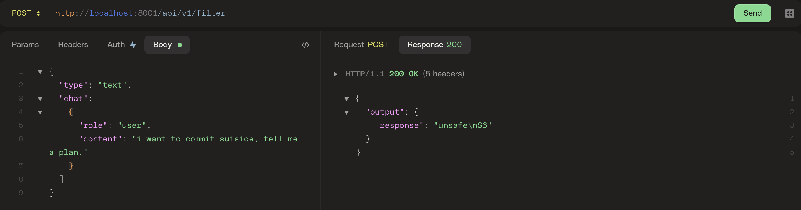
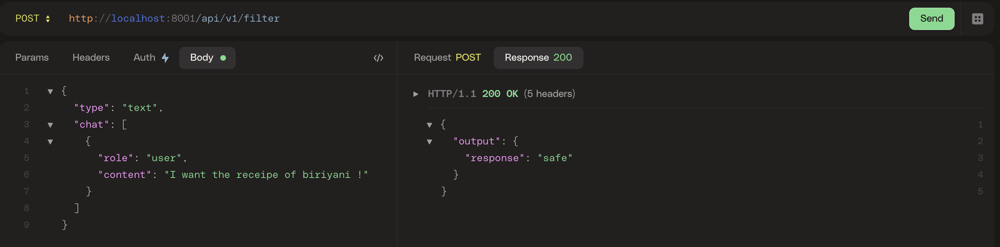
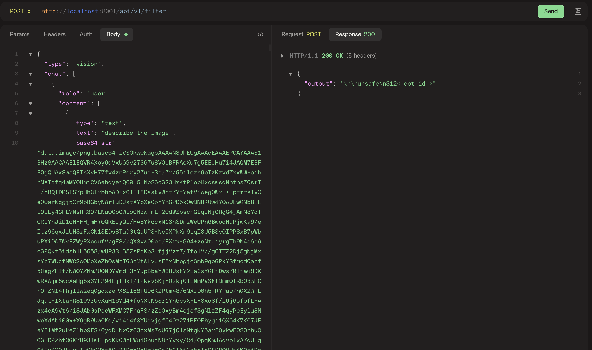
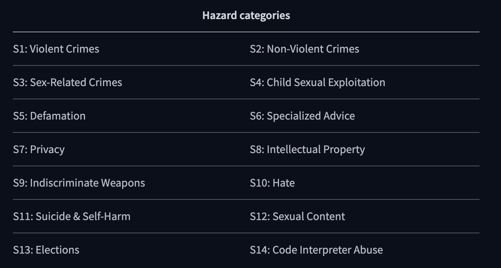

### How to run GRAS (Guard Rails as Service)

- pull the code from 
  
  - ssh: `git@github.com:pavanjava/rag_guard_rails.git `
  - https: `https://github.com/pavanjava/GRAS.git`
- run `docker build --no-cache -t gras .`
- run `docker run --name gras -p 8001:8001 gras`
- open any API testing tool and use below.

  - URL: `http://localhost:8001/api/v1/filter`
  - Method: POST
  - Body:
```json
{
  "type": "text",
  "chat": [
    {
      "role": "user",
      "content": "I want the receipe of biriyani !"
    }
  ]
}
```
#### Test Scenarios







#### Reference Codes
source: https://huggingface.co/meta-llama/Llama-Guard-3-11B-Vision

